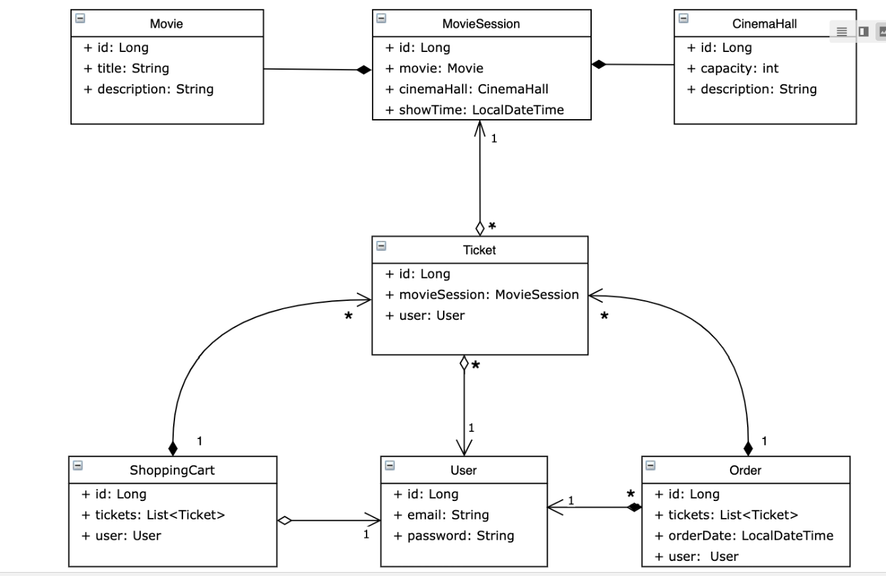

# cinema-app

This is a simple semulator of cinema service for reservation tickets, that supports registration, authentication,
and CRUD operations.

-register or login as a user

-create and find movie

-create and find available movies sessions

-create shopping cart

-add tickets to shopping cart

-complite order

-show orders history

Project structure:

Data access object layer

Service layer

Controller layer

Used technologies:
Java 11, Spring MVC, Security, Hibernate, MySql, Maven, REST, JSON, Jackson, Tomcat, Postman

Instructions for launching the project:

-make fork in your repository

-open project in IntelliJ IDEA ultimate;

-configure Tomcat and run Tomcat;

-enter login admin@i.ua and password admin123 how administrator

-go on page http://localhost:8080/register

-injoy our cinema-app

